Kubernetes 近几年很热门，在各大技术论坛上被炒的很火。它提供了强大的容器编排能力，与此同时 DevOps 的概念也来到大家身边，它模糊了开发和运维之间的边界，让大家更容易的从开发到运维一个大型的分布式系统。
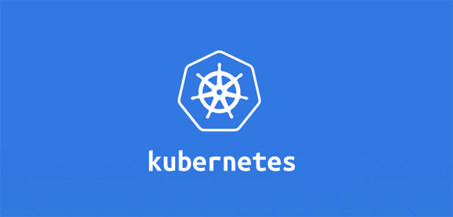
本文会以初学者的视角，希望能让读者更好地理解 Kubernetes 出现的背景、技术架构和设计理念，其中会涉及到部分实现原理。

# 背景
___
## Docker
Docker 是一个开源的应用容器引擎，让开发者可以打包他们的应用以及依赖包到一个可移植的容器中，然后发布到任何流行的 Linux 机器上，也可以实现虚拟化，Docker 的实现主要依赖于 Linux 的 namespace、cgroups 和 UnionFS。
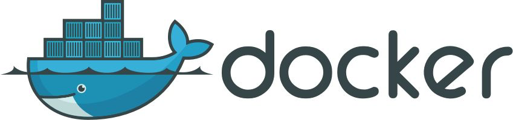
Docker 容器是完全使用沙箱机制，相互之间不会有任何接口。通过 Docker，实现进程、网络、挂载点和文件隔离，更好地利用宿主机资源。Docker 的强大到不需要关心宿主机的依赖，所有的一切都可以在镜像构建时完成，这也是 Docker 目前成为容器技术标准的原因。所以我们能看到在 Kubernetes 中 使用 Docker 作为容器（也支持 rkt）。

## 微服务
随着软件的规模越来越大，业务模式越来越复杂，用户量的上升、地区的分布、系统性能的苛刻要求促成服务架构的从单体变成 SOA 再到如今的微服务，未来还可能演变为 Service Mesh ，Serverless等等。
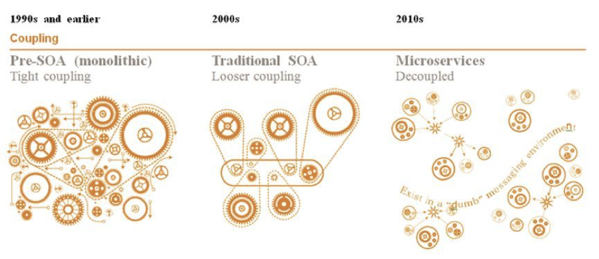
如今，一个完整的后端系统不再是单体应用架构了，伴随着多年前的 DDD 概念重新回到大家的视线中。现在的系统被不同的职责和功能被拆成多个服务，服务之间复杂的关系以及单机的单点性能瓶颈让部署和运维变得很复杂，所以部署和运维大型分布式系统的需求急迫待解决。

## Kubernetes
铺垫了这么多，终于说到本文的主角了。说 Kubernetes 之前，不得不提 Compose 和 Swarm，其实在 Kubernetes 还未一统江湖之前，这两个已经能实现大部分容器编排的能力了。但是在真正的大型系统上，它们却远远不如 Kubernetes。
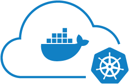
在容器化和微服务时代，服务越来越多，容器个数也越来越多。Docker 如它 Logo 所示一样，一只只鲸鱼在大海里自由地游荡，而 Kubernetes 就像一个掌舵的船长，带着它们，有序的管理它们，这个过程其实就是容器编排。

Kubernetes 起源于 Google，很多设计都是源自于 Borg，是一个开源的，用于管理云平台中多个主机上的容器化的应用，Kubernetes 的目标是让部署容器化的应用简单并且高效，并且提供了应用部署，规划，更新，维护的一种机制。

## 小结
至此，读者了解了 Kubernetes 的前世今生，它的出现使 DevOps 更加火热，普通的开发工程师也能做很多运维操作了。


# 设计理念
这一部分，我们会围绕 Kubernetes 的四个设计理念看看这些做法能给我们带来什么。

## 申明式VS命令式
声明式和命令式是截然不同的两种编程方式，在命令式 API 中，我们可以直接发出服务器要执行的命令，例如： “运行容器”、“停止容器”等；在声明式 API 中，我们声明系统要执行的操作，系统将不断向该状态驱动。

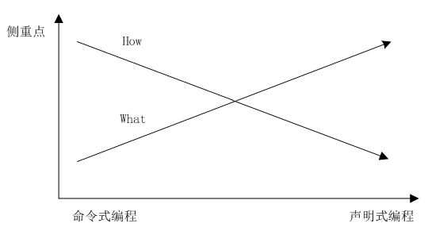
我们常用的 SQL 就是一种声明式语言，告诉数据库想要的结果集，数据库会帮我们设计获取这个结果集的执行路径，并返回结果集。众所周知，使用 SQL 语言获取数据，要比自行编写处理过程去获取数据容易的多。
```Yaml
apiVersion: extensions/v1beta1
kind: Deployment
metadata:
  name: etcd-operator
spec:
  replicas: 1
  template:
    metadata:
      labels:
        name: etcd-operator
    spec:
      containers:
      - name: etcd-operator
        image: quay.io/coreos/etcd-operator:v0.2.1
        env:
        - name: MY_POD_NAMESPACE
          valueFrom:
            fieldRef:
              fieldPath: metadata.namespace
        - name: MY_POD_NAME
          valueFrom:
            fieldRef:
              fieldPath: metadata.name
```
我们来看看相同设计的 YAML，利用它，我们可以告诉 Kubernetes 最终想要的是什么，然后 Kubernetes 会完成目标。

声明式 API 使系统更加健壮，在分布式系统中，任何组件都可能随时出现故障。当组件恢复时，需要弄清楚要做什么，使用命令式 API 时，处理起来就很棘手。但是使用声明式 API ，组件只需查看 API 服务器的当前状态，即可确定它需要执行的操作。

## 显示的API
Kubernetes 是透明的，它没有隐藏的内部 API。换句话说 Kubernetes 系统内部用来交互的 API 和我们用来与 Kubernetes 交互的 API 相同。

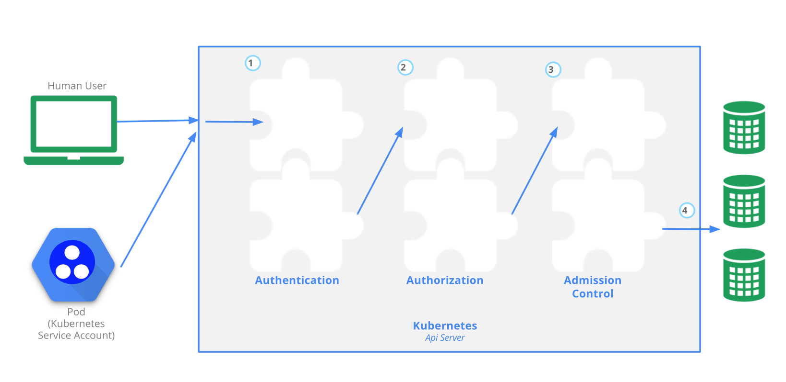
这样做的好处是，当 Kubernetes 默认的组件无法满足我们的需求时，我们可以利用已有的 API 实现我们自定义的特性。

## 无侵入性
感谢 Docker 容器技术的流行，使得 Kubernetes 为大家提供了无缝的使用方式。在容器化的时代，我们的应用达到镜像后，不需要改动就可以遨游在 Kubernetes 集群中。

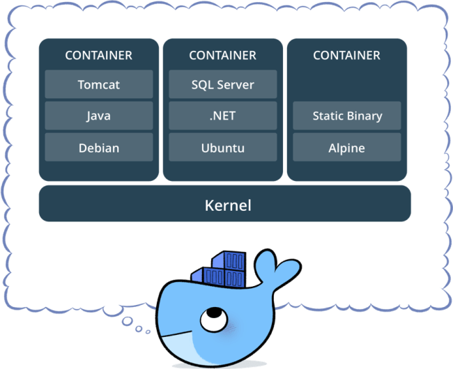
Kubernetes 还提供存储 Secret、Configuration 等包含但不局限于密码、证书、容器镜像信息、应用启动参数能力。如此，Kubernetes 以一种友好的方式将这些东西注入 Pod，减少了大家的工作量，而无需重写或者很大幅度改变原有的应用代码。

## 有状态的移植
在有状态的存储场景下，Kubernetes 如何做到对于服务和存储的分离呢？假设一个大型分布式系统使用了多家云厂商的存储方案，如何做到开发者无感于底层的存储技术体系，并且做到方便的移植？

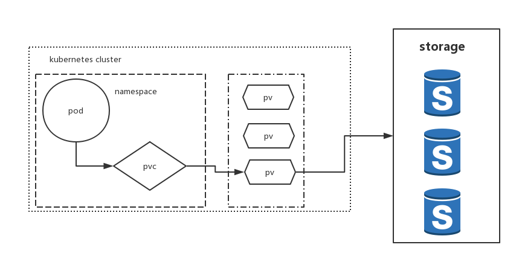
为了实现这一目标，Kubernetes 引入了 PersistentVolumeClaim（PVC）和 PersistentVolume（PV）API 对象。这些对象将存储实现与存储使用分离。

PersistentVolumeClaim 对象用作用户以与实现无关的方式请求存储的方法，通过它来抹除对底层 PersistentVolume 的差异性。这样就使 Kubernetes 拥有了跨集群的移植能力。

# 架构
首先要提及的是 Kubernetes 使用很具代表性的 C/S 架构方式，Client 可以使用 kubectl 命令行或者 RESTful 接口与 Kubernetes 集群进行交互。下面这张图是从宏观上看 Kubernetes 的整体架构，每一个 Kubernetes 集群都由 Master 节点 和 很多的 Node 节点组成。
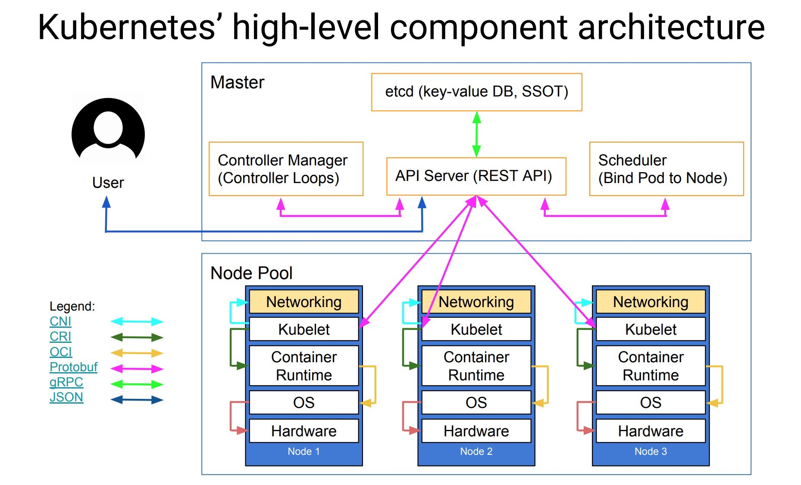

## Master

Master 是 Kubernetes 集群的管理节点，负责管理集群，提供集群的资源数据访问入口。拥有 Etcd 存储服务，运行 API Server 进程，Controller Manager 服务进程及 Scheduler 服务进程，关联工作节点 Node。

Kubernetes API Server 提供 HTTP Rest 接口的关键服务进程，是Kubernetes里所有资源的增、删、改、查等操作的唯一入口。也是集群控制的入口进程；
Kubernetes Controller Manager 是 Kubernetes 所有资源对象的自动化控制中心，它驱使集群向着我们所需要的最终目的状态；
Kubernetes Schedule是 负责 Pod 调度的进程。

## Node

Node 是 Kubernetes 集群架构中运行 Pod 的服务节点。Node 是 Kubernetes 集群操作的单元，用来承载被分配 Pod 的运行，是 Pod 运行的宿主机。关联 Master 管理节点，拥有名称和 IP、系统资源信息。运行 Docker Runtime、kubelet 和 kube-proxy。

kubelet 负责对Pod对于的容器的创建、启停等任务，发送宿主机当前状态；
kube-proxy 实现 Kubernetes Service 的通信与负载均衡机制的重要组件；
Docker Runtime 负责本机容器的创建和管理工作。

# 实现原理
为了尽可能的让读者能明白 Kubernetes 是如何运作的，这里不会涉及到具体的细节实现，如有读者感兴趣可以自行参阅官网文档。这里以一个简单的应用部署示例来阐述一些概念和原理。

## 创建 Kubernetes 集群
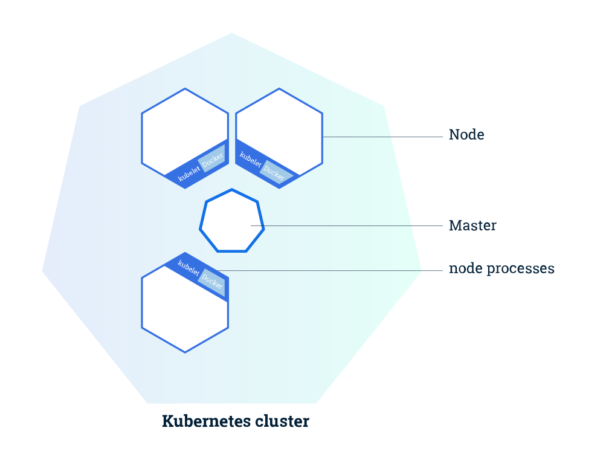
介绍架构的时候我们知道，Kubernetes 集群由 Master 和 Node 组成。

Master 管理集群的所有行为例如：应用调度、改变应用的状态，扩缩容，更新/降级应用等。

Node 可以是是一个虚拟机或者物理机，它是应用的“逻辑主机”，每一个 Node 拥有一个 Kubelet，Kubelet 负责管理 Node 节点与 Master 节点的交互，同时 Node 还需要有容器操作的能力，比如 Docker 或者 rkt。理论上来说，一个 Kubernetes 为了应对生产环境的流量，最少部署3个 Node 节点。

当我们需要在 Kubernetes 上部署应用时，我们告诉 Master 节点，Master 会调度容器跑在合适的 Node 节点上。

我们可以使用 Minikube 在本地搭一个单 Node 的 Kubernetes 集群。

## 部署应用
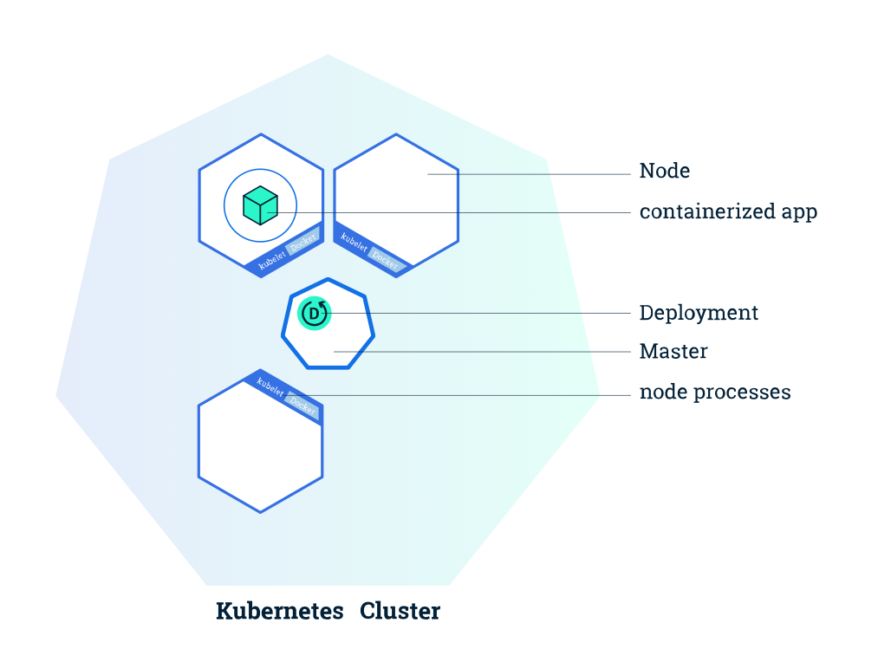
当创建好一个 Kubernetes 集群后，就可以把容器化的应用跑在上面了。我们需要创建一个 Deployment，它会告诉 Kubernetes Master 如何去创建应用，也可以来更新应用。

当应用实例创建后，Deployment 会不断的观察这些实例，如果 Node 上的 Pod 挂了，Deployment 会自动创建新的实例并且替换它。相比传统脚本运维的方式，这种方式更加优雅。

我们能通过 kubectl 命令或者 YAML 文件来创建 Deployment，在创建的时候需要指定应用镜像和要跑的实例个数，之后 Kubernetes 会自动帮我们处理。

## 查看Pods 和 Nodes
下面来介绍下 Pod 和 Node：
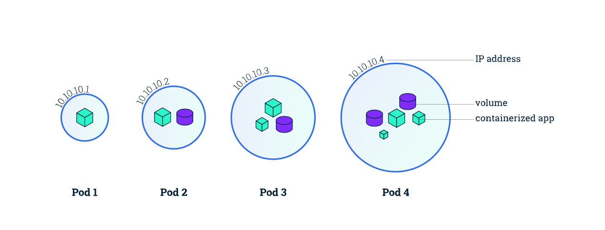
当我们创建好 Deployment 的时候，Kubernetes 会自动创建 Pod 来承载应用实例。Pod 是一个抽象的概念，像一个“逻辑主机”，它代表一组应用容器的集合，这些应用容器共享资源，包括存储，网络和相同的内部集群 IP。

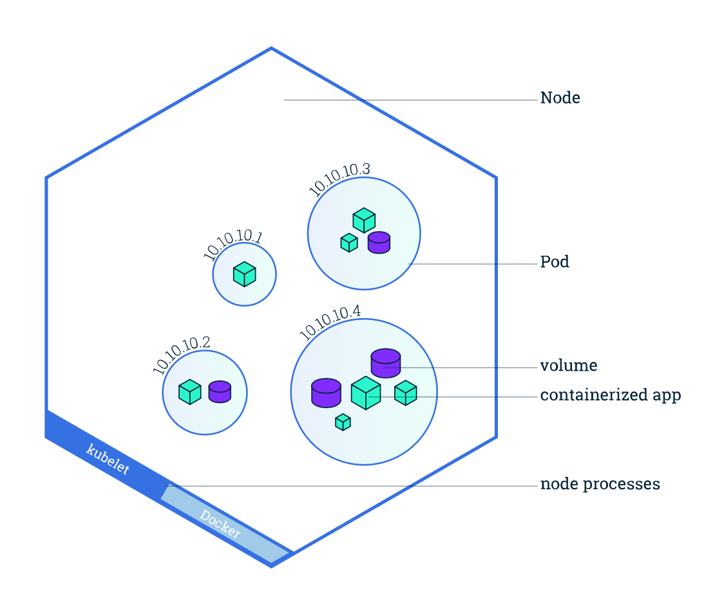
任何一个 Pod 都需要跑在一个 Node 节点上。Node 是一个“虚拟机器”，它可以是虚拟机也可以是物理机，一个 Node 可以有多个 Pods，Kubernetes 会自动调度 Pod 到合适的 Node 上。

## Service 与 LabelSelector
Pods 终有一死，也就是说 Pods 也有自己的生命周期，当一个 Pod 挂了的时候，ReplicaSet 会创建新的，并且调度到合适的 Node 节点上。考虑下访问的问题，Pod 替换伴随着 IP 的变化，对于访问者来说，变化的 IP 是合理的；并且当有多个 Pod 节点时，如何 SLB 访问也是个问题，Service 就是为了解决这些问题的。
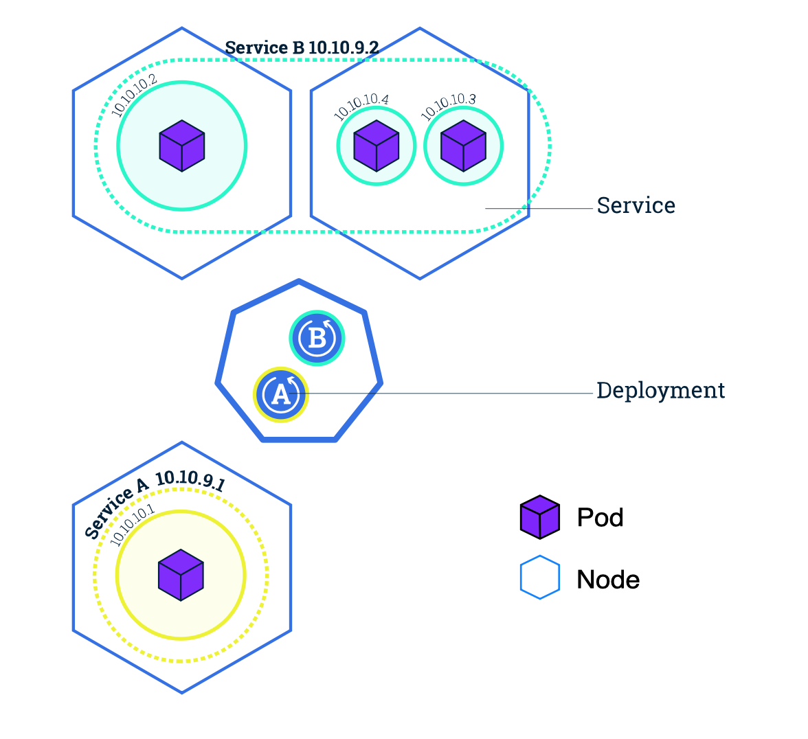

Service 是一个抽象的概念，它定义了一组逻辑 Pods，并且提供访问它们的策略。和其他对象一样，Service 也能通过 kubectl 或者 YAML 创建。Service 定义的 Pod 可以写在 LabelSelector 选项中（下文会介绍），也存在不指定 Pods 的情况，这种比较复杂，感兴趣的读者可以自行查阅资料。

Service 有以下几种类型：
- ClusterIP（默认）：在集群中内部IP上暴露服务，此类型使Service只能从群集中访问；
- NodePort：通过每个 Node 上的 IP 和静态端口（NodePort）暴露服务。NodePort 服务会路由到 ClusterIP 服务，这个 ClusterIP 服务会自动创建。通过请求 :，可以从集群的外部访问一个 NodePort 服务；
- LoadBalancer：使用云提供商的负载均衡器，可以向外部暴露服务。外部的负载均衡器可以路由到 NodePort 服务和 ClusterIP 服务；
- ExternalName：通过返回 CNAME 和它的值，（适用于外部 DNS 的场景）
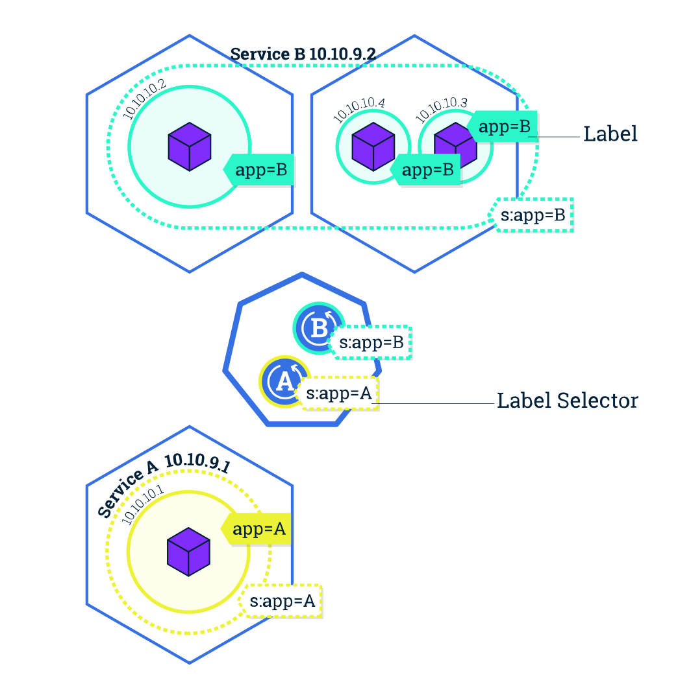

Labels 和 Selectors 能够让 Kubernetes 拥有逻辑运算的能力，有点像 SQL。举个例子：可以查找 app=hello_word 的所有对象，也可以查找 app in (a,b,c) abc的所有对象。

Labels是一个绑定在对象上的 K/V 结构，它可以在创建或者之后的时候的定义，在任何时候都可以改变。

## 应用扩用
前文提到我们可以使用 Deployment 增加实例个数，下图是原始的集群状态：
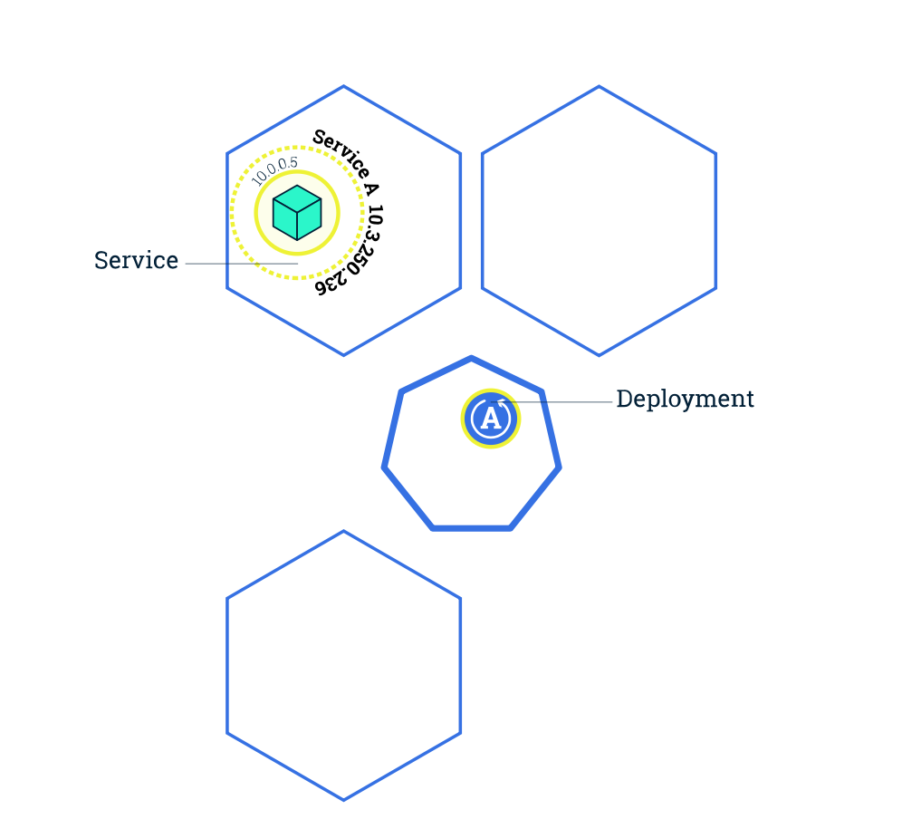
我们可以随意的更改 replicas （实例个数）来扩容，当我们更改了 Deployment 中的 replicas 值时，Kubernetes 会自动帮我们达到想要的目标实例个数，如下图：
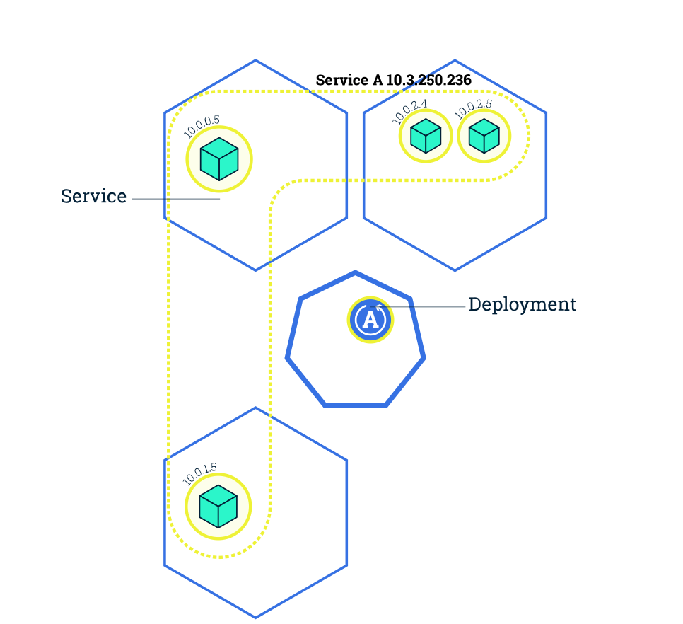

## 更新应用
更新应用和扩容类似，我们可以更改 Deployment 中的容器镜像，然后 Kubernetes 会帮住我们应用更新（蓝绿、金丝雀等方式），通过此功能，我们还可以实现切换应用环境、回滚、不停机CCD。下面是部署的过程，需要注意的是，我们可以指定新创建的 Pod 最大个数和不可用 Pod 最大个数：
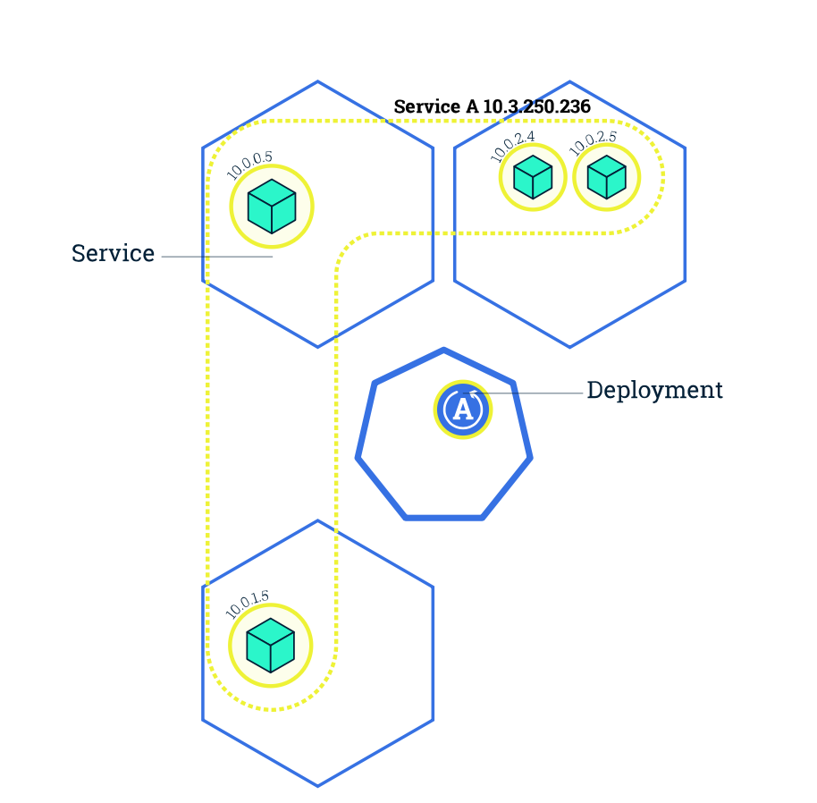
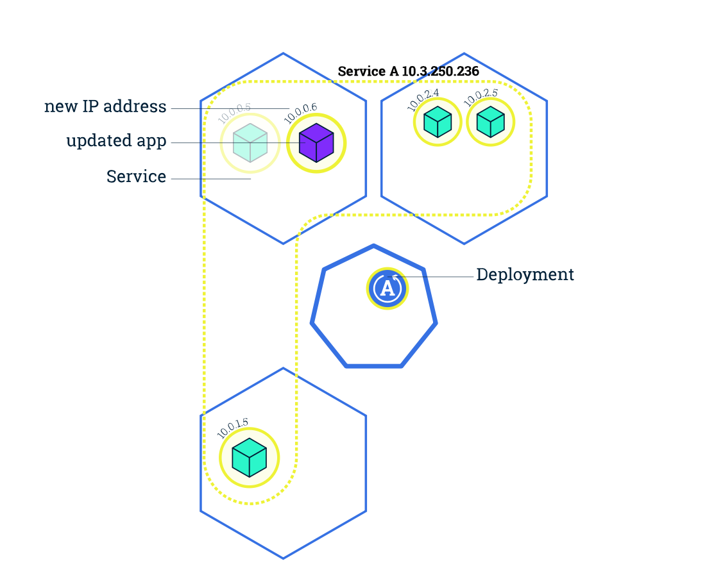
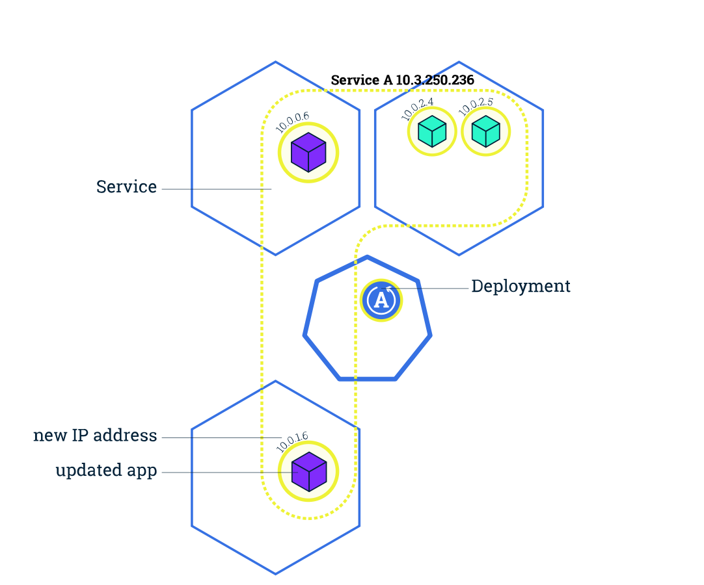
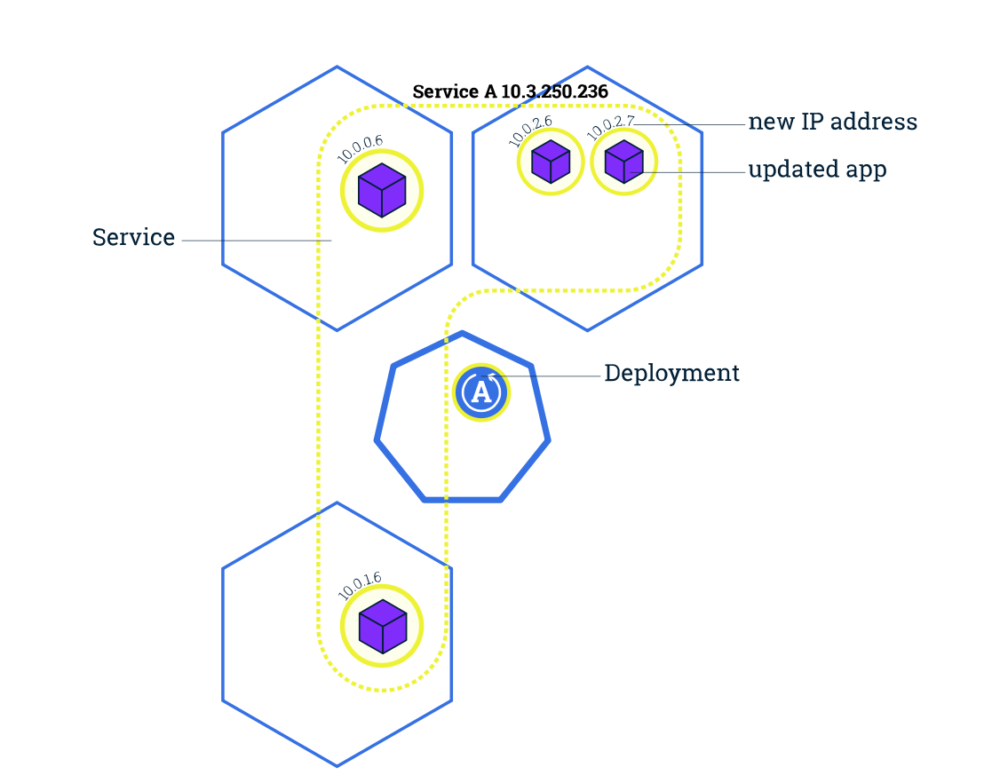

# 总结
到了最后，大家对 Kubernetes 能有个大概的了解了，但 Kubernetes 远远不止本文所介绍的这些内容。


